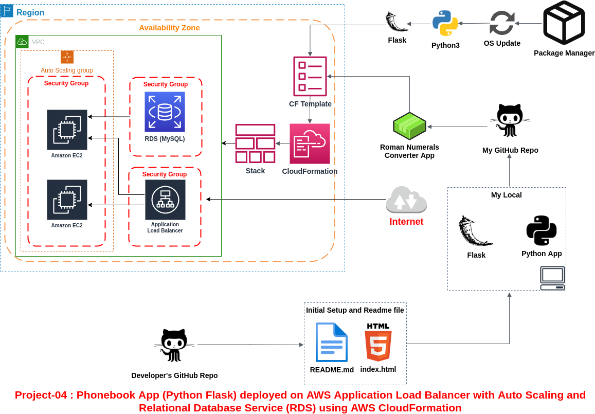
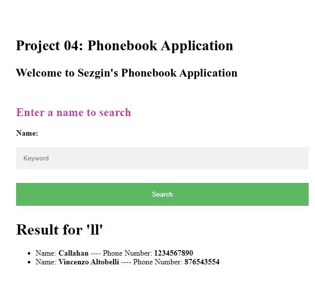

# Project-04: Phonebook App (Python Flask) deployed on AWS Application Load Balancer with Auto Scaling and Relational Database Service (RDS) using AWS CloudFormation

## <u>Description</u>

The Phonebook Application aims to create a phonebook application via Python and deployed as a web application with Flask on AWS Application Load Balancer with Auto Scaling Group of Elastic Compute Cloud (EC2) Instances and Relational Database Service (RDS) using AWS CloudFormation Service.



## <u>Problem Statement</u>

My company has recently started a project that aims to serve as phonebook web application. Me and my colleagues have started to work on the project. My teammates have developed the UI part the project as shown in the template folder and they need your help to develop the coding part and deploying the app in development environment.

## <u>Requirements</u>

- As a first step, you need to write program that creates a phonebook, adds requested contacts to the phonebook, finds and removes the contacts from the phonebook.

- Application should allow users to search, add, update and delete the phonebook records and the phonebook records should be kept in separate MySQL database in AWS RDS service. Following is the format of data to be kept in db.

  - id: unique identifier for the phone record, type is numeric.

  - person: full name of person for the phone record, type is string.

  - number: phone number of the person. type is numeric.

- All the interactions with user on phonebook app should be done in case insensitive manner and name of the person should be formatted so that, only the first letters of each words in the name of the person should be in capital letters. If the user inputs number in the username field, user should be warned with text message.

- Phone numbers in the app can be in any format, but the inputs should be checked to prevent string type. If the user inputs string in the number field, user should be warned with text message.

- Example for user inputs and respective formats

```text
Input in username field          Format to convert
--------------                   -----------------
''                               Warning -> 'Invalid input: Name can not be empty'
sezgin                           Sezgin
joHn doE                         John Doe
62267                            Warning -> 'Invalid input: Name of person should be text'

Input in number field            Format to convert
--------------                   -----------------
''                               Warning -> 'Invalid input: Phone number can not be empty'
1234567890                       1234567890
546347                           546347
thousand                         Warning -> 'Invalid input: Phone number should be in numeric format'
```
- As a second step, after you finish the coding, you are requested to deploy your web application using Python's Flask framework.

- You need to transform your program into web application using the `index.html`, `add-update.html` and `delete.html` within the `templates` folder. Note the followings for your web application.

  - User should face first with `index.html` when web app started and th user should be able to; 

    - search the phonebook using `index.html`.

    - add or update a record using `add-update.html`.

    - delete a record using `delete.html`.

  - User input can be either integer or string, thus the input should be checked for the followings,

    - The input for name should be string, and input for the phone number should be decimal number.

    - When adding, updating or deleting a record, inputs can not be empty.

    - If the input is not conforming with any conditions above, user should be warned using the `index.html` with template formatting.

  - The Web Application should be accessible via web browser from anywhere.

- Lastly, after transforming your code into web application, you are requested to push your program to the project repository on the Github and deploy your solution in the development environment on AWS Cloud using AWS CloudFormation Service to showcase your project. In the development environment, you can configure your CloudFormation template using the followings,

  - The application stack should be created with new AWS resources.

  - Template should create Application Load Balancer with Auto Scaling Group of Amazon Linux 2 EC2 Instances within default VPC.

  - Application Load Balancer should be placed within a security group which allows HTTP (80) connections from anywhere.

  - EC2 instances should be placed within a different security group which allows HTTP (80) connections only from the security group of Application Load Balancer.

  - The Auto Scaling Group should use a Launch Template in order to launch instances needed and should be configured to;

    - use all Availability Zones.

    - set desired capacity of instances to `2`

    - set minimum size of instances to `1`

    - set maximum size of instances to `3`

    - set health check grace period to `90 seconds`

    - set health check type to `ELB`

  - The Launch Template should be configured to;

    - prepare Python Flask environment on EC2 instance,

    - download the Phonebook Application code from Github repository,

    - deploy the application on Flask Server.

  - EC2 Instances type can be configured as `t2.micro`.

  - Instance launched by CloudFormation should be tagged `Web Server of StackName`

  - For RDS Database Instance;
  
    - Instance type can be configured as `db.t2.micro`

    - Database engine can be `MySQL` with version of `8.0.19`.

  - Phonebook Application Website URL should be given as output by CloudFormation Service, after the stack created.


## <u>Steps to Solution</u>
  
- ### Step 1: Download or clone project definition from My repo on Github

I cloned the project's repos to my local.

```bash
$ git clone https://github.com/sezginerdem/p04-Phonebook-App-deployed-on-AWS-ALB-with-AS-and-RDS-using-CF.git
```

- ### Step 2: Write the Phonebook Application in Python

Looking at the requirements of the project, I wrote the Phonebook Web Application with Python.

- ### Step 3: Transformed my application into web application using Python Flask framework

Looking at the requirements of the project, I transform it usable in the web environment using the application Python Flask framework.

- ### Step 4: Prepare a CloudFormation template to deploy your app on Application Load Balancer together with RDS

I created CloudFormation to automate the deployment of my website.

First of all, I added my explanation to the description section, which shows what my CloudFormation Template was written for.

```yaml 
AWSTemplateFormatVersion: 2010-09-09
Description: |
  CloudFormation Template for Phonebook Application. This template creates Application Load Balancer 
  with Auto Scaling Group of Amazon Linux 2 (ami-0947d2ba12ee1ff75) EC2 Instances which host Python Flask Web Application.
  EC2 instances are placed within WebServerSecurityGroup which allows http (80) connections only from ALBSecurityGroup,
  and allows tcp(3306) connections only within itself. RDS DB instance is placed within WebServerSecurityGroup so that
  Database Server can communicate with Web Servers.
  Application Load Balancer is placed within ALBSecurityGroup which allows http (80) connections from anywhere.
  WebServerASG Auto Scaling Group is using the WebServerLT Launch Template in order to spin up instances needed.
  WebServerLT Launch Template is configured to prepare Python Flask environment on EC2,
  and to deploy Phonebook Application on Flask Server after downloading the app code from Github repository.
  ```

I added a security group (SG) to the Resources section as a priority. First, I wrote the SGs of the EC2s I created with the launch template (LT). I did not define VPC as I am using Default VPC. Since I defined ingress rule, I did not define ingress rule. I opened HTTP and SSH ports as ingress rule.


I defined SourceSecurityGroupId instead of CidrIp on HTTP port. Here I got the id of the SG I created with the !GetAtt method. The reason for this is ALB is the first resource that the client would request, and I need to define the ALB SG here, since EC2s will perform requests from ALB.

```yaml
Resources:
  WebServerSecurityGroup:
    Type: AWS::EC2::SecurityGroup
    Properties:
      GroupDescription: Enable HTTP for Flask Web Server and Ssh for entering to EC2
      SecurityGroupIngress:
         - IpProtocol: tcp
           FromPort: 22
           ToPort: 22
           CidrIp: 0.0.0.0/0
         - IpProtocol: tcp
           FromPort: 80
           ToPort: 80
           SourceSecurityGroupId: !GetAtt ALBSecurityGroup.GroupId
```

I named ALB SG `ALBSecurityGroup`. Since it will only listen on port 80, I only opened this port. I used default VPC.

```yaml
ALBSecurityGroup:
    Type: AWS::EC2::SecurityGroup
    Properties:
      GroupDescription: Enable HTTP for Application Load Balancer
      SecurityGroupIngress:
        - IpProtocol: tcp
          FromPort: 80
          ToPort: 80
          CidrIp: 0.0.0.0/0
```

I created my LT with the name `WebServerLT`. In LT, I set my instance type as t2.micro. I wrote the name of the key I have as the `ec2keyname`. I got the `GroupId` of the `WebServerSecurityGroup` that I had created before as an SG with the `!GetAtt` method. I used the `!Sub` function to assign the name to the stack as a tag.

```yaml
WebServerLT:
    Type: AWS::EC2::LaunchTemplate
    Properties:
      LaunchTemplateData: 
        ImageId: ami-0947d2ba12ee1ff75
        InstanceType: t2.micro
        KeyName: ec2keyname
        SecurityGroupIds: 
          - !GetAtt WebServerSecurityGroup.GroupId
        TagSpecifications: 
          - ResourceType: instance
            Tags:
              - Key: Name
                Value: !Sub Web Server of ${AWS::StackName} Stack
```

I created the Launch Template im user data. I took the endpoint of the db with the !GetAtt function and assigned it to the MyDBURI variable. I saved this variable to a file in EC2 with `echo "${MyDBURI}" > /home/ec2-user/dbserver.endpoint` command. I created a token and thanks to this token, I pulled my files from GitHub with the curl command. Finally, I ran my application with `python3 /home/ec2-user/app.py`.


```yaml
UserData:
  Fn::Base64:
    !Sub 
      - |
        #! /bin/bash
        yum update -y
        yum install python3 -y
        pip3 install flask
        pip3 install flask_mysql
        echo "${MyDBURI}" > /home/ec2-user/dbserver.endpoint
        TOKEN="94eddca57871d6cbcb24babb5e0ff31f30226804"
        FOLDER="https://$TOKEN@https://raw.githubusercontent.com/sezginerdem/p04-Phonebook-App-deployed-on-AWS-ALB-with-AS-and-RDS-using-CF/master/"
        curl -s --create-dirs -o "/home/ec2-user/templates/index.html" -L "$FOLDER"templates/index.html
        curl -s --create-dirs -o "/home/ec2-user/templates/add-update.html" -L "$FOLDER"templates/add-update.html
        curl -s --create-dirs -o "/home/ec2-user/templates/delete.html" -L "$FOLDER"templates/delete.html
        curl -s --create-dirs -o "/home/ec2-user/app.py" -L "$FOLDER"phonebook-app.py
        python3 /home/ec2-user/app.py
      - MyDBURI: !GetAtt MyDatabaseServer.Endpoint.Address
```

I defined the target group (TG) with the name `WebServerTG`. Here I made the configurations by looking at the requirements. I also got the `VpcId` from `WebServerSecurityGroup.VpcId` with the `!GetAtt` function.

```yaml
WebServerTG:
   Type: "AWS::ElasticLoadBalancingV2::TargetGroup"
   Properties:
     Port: 80
     Protocol: HTTP
     TargetType: instance
     UnhealthyThresholdCount: 3
     HealthyThresholdCount: 2
     VpcId: !GetAtt WebServerSecurityGroup.VpcId
```

ALB with the name `ApplicationLoadBalancer`. While creating `SecurityGroups`, I pulled SG from `ALBSecurityGroup.GroupId` with `!GetAtt` function. I got my default subnets here. Since it is ALB, I defined `application` as `Type`.


```yaml
ApplicationLoadBalancer:
  Type: "AWS::ElasticLoadBalancingV2::LoadBalancer"
  Properties:
    IpAddressType: ipv4
    Scheme: internet-facing
    SecurityGroups:
      - !GetAtt ALBSecurityGroup.GroupId
    Subnets:
      - subnet-077c9758
      - subnet-3246e63c
      - subnet-3ccd235a
      - subnet-8d8dbfb3
      - subnet-c41ba589
      - subnet-ed49bccc
    Type: application
```

I wrote my listener with the name `ALBListener`. I wrote that it should listen to TG in `DefaultActions`. There are several different ways to determine TG, I chose this one. I achieved this with `TargetGroupArn: !Ref WebServerTG`. I set its `Type` as `forward`. I set the 'Port' number as '80' and the protocol as 'HTTP'.

```yaml
ALBListener:
  Type: "AWS::ElasticLoadBalancingV2::Listener"
  Properties:
    DefaultActions: #required
      - TargetGroupArn: !Ref WebServerTG
        Type: forward
    LoadBalancerArn: !Ref ApplicationLoadBalancer #required
    Port: 80 #required
    Protocol: HTTP #required
```

I created an AutoScaling Group (ASG) with the name `WebServerASG`. With `!GetAZs ""` I defined that ASG can occur in all AZs. I used `LaunchTemplate` instead of `InstanceId`. `LaunchTemplateId: !Ref WebServerLT` line with the `!Ref` function, I wrote the name of the LT and pulled it here. I got the `VersionNumber` of LT with the line `Version: !GetAtt WebServerLT.LatestVersionNumber`. This one is listening to a TG too. Just like I display the address in LB, I have shown the address of `WebServerTG` with the `!Ref` function in `TargetGroupARN`.

```yaml
WebServerASG:
  Type: "AWS::AutoScaling::AutoScalingGroup"
  Properties:
    AvailabilityZones:
      !GetAZs ""
    DesiredCapacity: 2
    HealthCheckGracePeriod: 300
    HealthCheckType: ELB
    LaunchTemplate:
      LaunchTemplateId: !Ref WebServerLT
      Version: !GetAtt WebServerLT.LatestVersionNumber
    MaxSize: 3 #required
    MinSize: 1 #required
    TargetGroupARNs:
      - !Ref WebServerTG
```

To create a DB server, I need to create 2 resources. One of them is DB SG and the other is DB.

I made a SG definition for the DB and gave it `MyDBSecurityGroup` for it. I defined `0.0.0.0/0` as `CIDRIP` blog. However, normally the 'CIDRIP' blog of `VPC` should be written here or if there is a subnet range that you want to put in particular, it can be written here. I brought the `WebServerSecurityGroup.GroupId` that will reach here as `EC2SecurityGroupId` with the `!GetAtt` function.


```yaml
MyDBSecurityGroup:
  Type: AWS::RDS::DBSecurityGroup
  Properties:
    GroupDescription: Front-end access
    DBSecurityGroupIngress:
      - CIDRIP: 0.0.0.0/0
      - EC2SecurityGroupId: !GetAtt WebServerSecurityGroup.GroupId
```

I set the DB name as `MyDatabaseServer`. I set '20GB' as 'Storage'. I want to use the current `mysql` version with `AllowMajorVersionUpgrade: false` and I specify that I do not want a major upgrade. I specify that I want a minor upgrade with `AutoMinorVersionUpgrade: true`.

```yaml
MyDatabaseServer:
  Type: AWS::RDS::DBInstance
  DeletionPolicy: Delete
  Properties:
    AllocatedStorage: 20
    AllowMajorVersionUpgrade: false 
    AutoMinorVersionUpgrade: true
    BackupRetentionPeriod: 0 #do not get backup
    DBInstanceIdentifier: phonebook-app-db2
    DBName: phonebook
    DBSecurityGroups: #Pulled the DB SG by typing the name MyDBSecurityGroup
      - !Ref MyDBSecurityGroup
    Engine: MySQL #set engine
    DBInstanceClass: db.t2.micro #Required
    EngineVersion: 8.0.19 #set version
    MasterUsername: Sezgin 
    MasterUserPassword: Sezgin_1
    MultiAZ: false #wrote false because I don't want the db to stand up in another AZ in the failover scenario.
    Port: 3306
    PubliclyAccessible: true #Allowed my EC2s to reach
```
For easy access to the DNS address, I created the output section, for this I made the following coding

```yaml
Outputs:
  WebsiteURL:
    Value: !Sub 
      - http://${ALBAddress} #Put the address I assigned in front of HTTP and thus an address was created
      - ALBAddress: !GetAtt ApplicationLoadBalancer.DNSName #Did the assignment of the ALB DNS name
    Description: Phonebook Application Load Balancer URL
```

- ### Step 5: Push your application into your own public repo on Github

I uploaded the files created in my local to my GitHub repo.

```bash
git add .
git commit -m "added phonebook.yml, init-phonebook-db.py, phonebook-app.py"
git push
```

- ### Step 5: Deployed my application on AWS Cloud using CloudFormation template to showcase your app

I opened the AWS console. First of all, I uploaded my CloudFormation template to CloudFormation/Designer. I checked if there is a problem. After seeing that there was no problem, I uploaded my CloudFormation. When I clicked on the URL in Outputs, I saw that my application was running successfully. Screenshots of index.html and result.html pages are as follows.


## <u>Outcome</u>



## <u>Improvements in the future for the present system:</u>

This LT is used in EC2s that will be created after both db and AS with the LT used. EC2s that will be created with AS terminate the db. I suggest a solution for this problem as well:
Create another different EC2. Let this EC2 run the `init-phonebook-db.py` file. Then have this EC2 terminate itself after a short while. Let the task of this EC2 be just to create db. The LT to be created for AS should not have an initialize section. Since there is no such initialize section, every newly produced machine will not delete the db.
In the template to be prepared, set the `InstanceInitiatedStutdownBehaviour` field to terminate, add `initialize.py` in this template and set how long it will terminate. You can also set when to terminate with a script to be placed in Userdata.