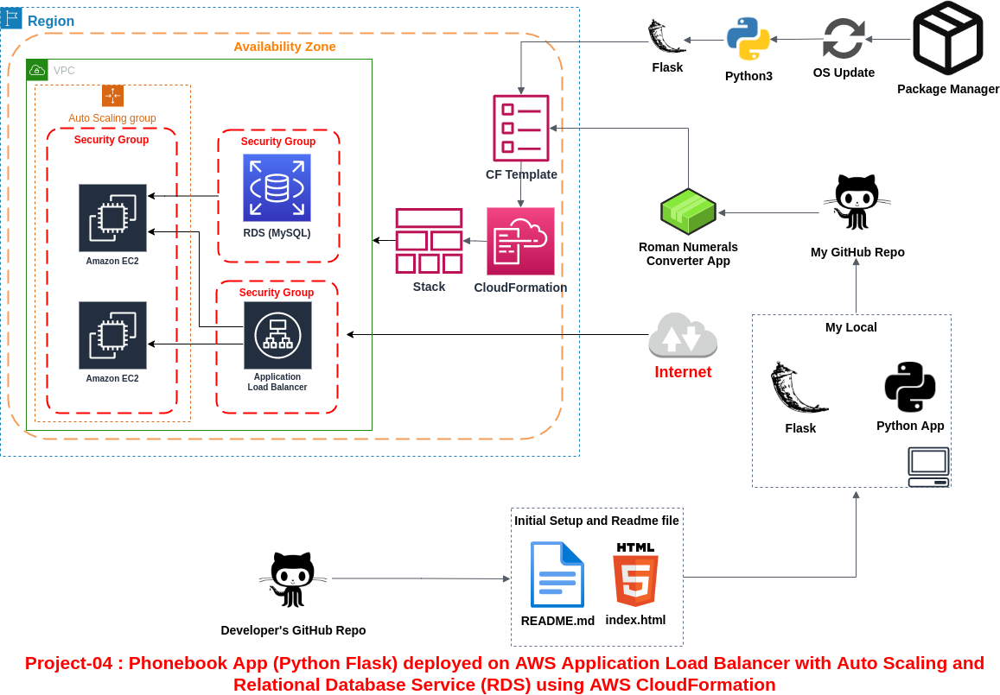
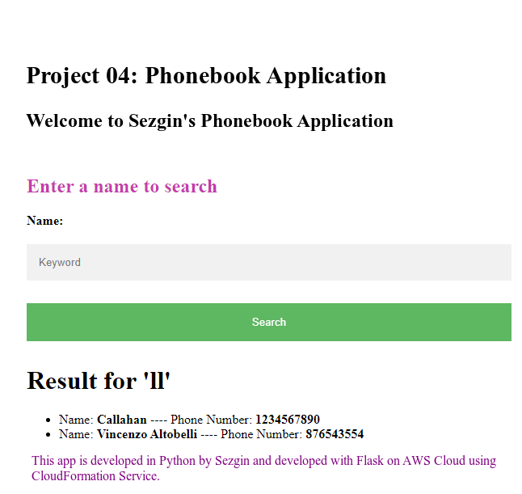

# Project-04: Phonebook App (Python Flask) deployed on AWS Application Load Balancer with Auto Scaling and Relational Database Service (RDS) using AWS CloudFormation

## 1. Project Introduction:

The Phonebook Application aims to create a phonebook application via Python and deployed as a web application with Flask on AWS Application Load Balancer with Auto Scaling Group of Elastic Compute Cloud (EC2) Instances and Relational Database Service (RDS) using AWS CloudFormation Service.

## 2. Modules description:

- Download or clone project definition from My repo on Github

- Write the Phonebook Application in Python

- Transformed my application into web application using Python Flask framework

- Prepare a CloudFormation template to deploy your app on Application Load Balancer together with RDS

- Push your application into your own public repo on Github

- Deployed my application on AWS Cloud using CloudFormation template to showcase your app

## 3. Advantages and the main functionality of your application:

- My Web App adds requested contacts to the phonebook, finds and removes the contacts from the phonebook.

- This app should allow users to search, add, update and delete the phonebook records and the phonebook records should be kept in separate MySQL database in AWS RDS service.

- I automate the creation of my application and infrastructure with the CloudFormation I prepared. So I was able to redeploy my app in seconds. I saved time.

## 4. Tools, Technologies, and Platform used:

- Python / Python Flask
- Git / GitHub
- Bash Scripting
- AWS CloudFormation
- MySQL DB
- AWS RDS
- AWS EC2
- AWS Launch Template
- AWS Application Load Balancer
- AWS Auto Scaling Group
- AWS Security Group

## 5. Personal contribution and your role in the project:

We did this project in 1 week with 3 of my teammates. I was at every stage of the project from start to finish. The place where I contribute the most is the writing phase of CloudFormation.

## 6. Challenges in the project:

The most difficult part was throwing the db endpoit somewhere in EC2 and establishing a connection between db and EC2. I solved this with the codes I wrote in python.

## 7. Improvements in the future for the present system:

This LT is used in EC2s that will be created after both db and AS with the LT used. EC2s that will be created with AS terminate the db. I suggest a solution for this problem as well:
Create another different EC2. Let this EC2 run the `init-phonebook-db.py` file. Then have this EC2 terminate itself after a short while. Let the task of this EC2 be just to create db. The LT to be created for AS should not have an initialize section. Since there is no such initialize section, every newly produced machine will not delete the db.
In the template to be prepared, set the `InstanceInitiatedStutdownBehaviour` field to terminate, add `initialize.py` in this template and set how long it will terminate. You can also set when to terminate with a script to be placed in Userdata.

## 8. Drawbacks:

The problem of deleting the db when creating a new instance from AS's LT is a disadvantage.

## 9. Outcome

